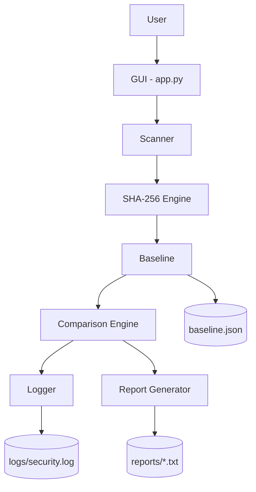

# 🛡️ Sentinel — File Integrity Monitoring System


A lightweight, desktop File Integrity Monitoring (FIM) tool built in pure Python. Sentinel detects when files inside a monitored folder are **modified**, **deleted**, or **newly added**, using SHA-256 hashing to verify integrity — no cloud services, databases, or machine learning required.

This project was built as a final-year engineering cybersecurity project to demonstrate the core principles behind real-world FIM tools such as Tripwire, OSSEC, and AIDE.

---

## 📖 Project Overview

File Integrity Monitoring is a foundational security control used to detect unauthorized changes to critical files — a key technique in intrusion detection, malware analysis, and compliance auditing (e.g. PCI-DSS, HIPAA).

Sentinel implements this concept from scratch:

1. It **hashes** every file in a chosen folder using SHA-256.
2. It **stores** those hashes as a trusted "baseline" snapshot.
3. On future scans, it **re-hashes** the folder and **compares** results against the baseline.
4. Any mismatch is reported as a modification, deletion, or new file — displayed live on a security dashboard and logged for auditing.

---

## 🎯 Objectives

- Demonstrate practical use of cryptographic hashing for integrity verification.
- Build a complete, modular Python application following clean coding practices.
- Provide a professional, console-style GUI so the tool is usable without command-line knowledge.
- Produce persistent logs and reports suitable for a security audit trail.
- Keep the entire project dependency-free (Python standard library only).

---

## ✨ Features

- **Baseline Creation** — Recursively scans a folder and records SHA-256 hashes, file paths, and timestamps into `baseline.json`.
- **Folder Scanning** — Re-scans the folder and compares the fresh results against the stored baseline.
- **Modified File Detection** — Flags files whose hash has changed, showing old hash, new hash, and detection time.
- **Deleted File Detection** — Flags files present in the baseline but missing from the current scan.
- **New File Detection** — Flags files present in the current scan but absent from the baseline.
- **Live Security Dashboard** — Files scanned, modified, deleted, and new-file counts, last scan time, and baseline status — refreshed automatically after every scan.
- **Color-Coded Event Console** — A terminal-style, timestamped log view with `INFO` / `OK` / `WARNING` / `THREAT` severity coloring and auto-scroll.
- **Progress Indicator** — A live progress bar during baseline creation and scanning.
- **Security Logging** — Every event (scans, baselines, modifications, deletions, additions, errors) is written to `logs/security.log` with a timestamp.
- **Professional Report Generation** — Produces a timestamped `.txt` report after each scan, with a structured layout covering scan metadata, per-category results, and an overall integrity summary.
- **Modern Dark-Themed GUI** — A Tkinter interface styled as a security console: dark charcoal background, blue accent buttons with hover effects, and a black/green monospace console.
- **Optional Application Icon** — Automatically loads `icon.ico` if present next to `app.py`.
- **Robust Error Handling** — Gracefully handles missing baselines, invalid folders, permission-denied errors, corrupted baseline files, and locked files, with friendly popup dialogs instead of crashes.
- **Memory-Efficient Hashing** — Files are streamed in 64 KB chunks, so even very large files never need to be loaded fully into memory.
- **Responsive UI** — Scans and baseline creation run on background threads so the interface never freezes.

---

## 🏗️ Architecture



Each module has a single, focused responsibility:

| Module | Responsibility |
|---|---|
| `app.py` | GUI, event wiring, background threading, dashboard/console/report presentation |
| `scanner.py` | Recursively walks a folder and hashes every file |
| `hashing.py` | Memory-efficient, chunked SHA-256 computation |
| `baseline.py` | Create / load / save / compare `baseline.json` |
| `logger.py` | Configures `logs/security.log` |
| `report.py` | Builds and saves professional scan reports |
| `utils.py` | Shared helpers (timestamps, size formatting) |

---

## 🖥️ Tech Stack

Built entirely with the Python standard library:

- `hashlib` – SHA-256 hashing
- `os` / `pathlib` – filesystem traversal
- `json` – baseline persistence
- `logging` – security event logging
- `datetime` – timestamps
- `tkinter` / `ttk` – graphical user interface
- `threading` – keeping the UI responsive during scans

No third-party packages, no databases, no external APIs, no ML.

---

## ⚙️ Installation

**Requirements:** Python 3.8 or newer (Tkinter ships with most standard Python installations on Windows, macOS, and Linux).

1. Clone or download this repository.
2. (Linux only) If Tkinter is not already installed:
   ```bash
   sudo apt install python3-tk
   ```
3. No `pip install` is required — Sentinel uses only the Python standard library.
4. *(Optional)* Place an `icon.ico` file in the project root to give the window a custom application icon.

---

## ▶️ Usage

From the project's root folder:

```bash
python app.py
```

### Basic Workflow

1. Click **Browse Folder** and select the folder you want to monitor.
2. Click **Create Baseline** to record the current, trusted state of the folder.
3. Later, click **Scan Folder** to compare the current state against the baseline.
4. Watch the live dashboard update, and review color-coded results in the event console — modified, deleted, and new files are all listed.
5. Click **Generate Report** to save a detailed `.txt` summary inside `reports/`.
6. Check `logs/security.log` at any time for a full audit trail of every event.

A `sample_files/` folder is included so you can try Sentinel immediately without pointing it at your own real files.

---

## 📸 Screenshots

_Add screenshots of the running application here, for example:_

- `screenshots/main_window.png` — Main dashboard and console view
- `screenshots/scan_results.png` — Scan results showing modified/deleted/new files
- `screenshots/report_sample.png` — A generated report opened in a text editor

---

## 📁 Folder Structure

```
Sentinel/
│
├── app.py              # GUI entry point; wires all modules together
├── scanner.py           # Recursively walks a folder and hashes every file
├── hashing.py           # SHA-256 hashing logic (memory-efficient, chunked)
├── baseline.py          # Create / load / save / compare baseline.json
├── logger.py            # Configures logs/security.log
├── report.py            # Builds and saves professional scan reports
├── utils.py             # Shared helper functions (timestamps, formatting)
├── baseline.json         # Stored baseline snapshot (created by the app)
├── icon.ico              # Optional application icon (auto-detected if present)
│
├── logs/
│   └── security.log     # Auto-generated audit log of all events
│
├── reports/
│   └── Report_YYYY_MM_DD_HH_MM.txt   # Auto-generated scan reports
│
├── sample_files/        # Sample folder for testing Sentinel out of the box
│
└── README.md
```

---

## 🚀 Future Scope

The following are intentionally **out of scope** for this version but represent natural next steps for a production-grade FIM tool:

- **Real-time monitoring** — continuous background watching instead of on-demand scans
- **Email alerts** — automatic notifications the moment a change is detected
- **Cloud backup** — off-site storage of baselines and reports
- **Administrator authentication** — access control before sensitive actions (e.g. baseline overwrite)
- **SIEM integration** — forwarding logs to platforms like Splunk or the ELK stack
- **Machine learning anomaly detection** — behavioral analysis to flag unusual change patterns
- **Threat intelligence feeds** — cross-referencing hashes against known-malicious file databases
- **Dashboard analytics** — historical trend charts and long-term integrity reporting

---

## 📄 License

This project is released under the MIT License. You are free to use, modify, and distribute it for educational or portfolio purposes.
